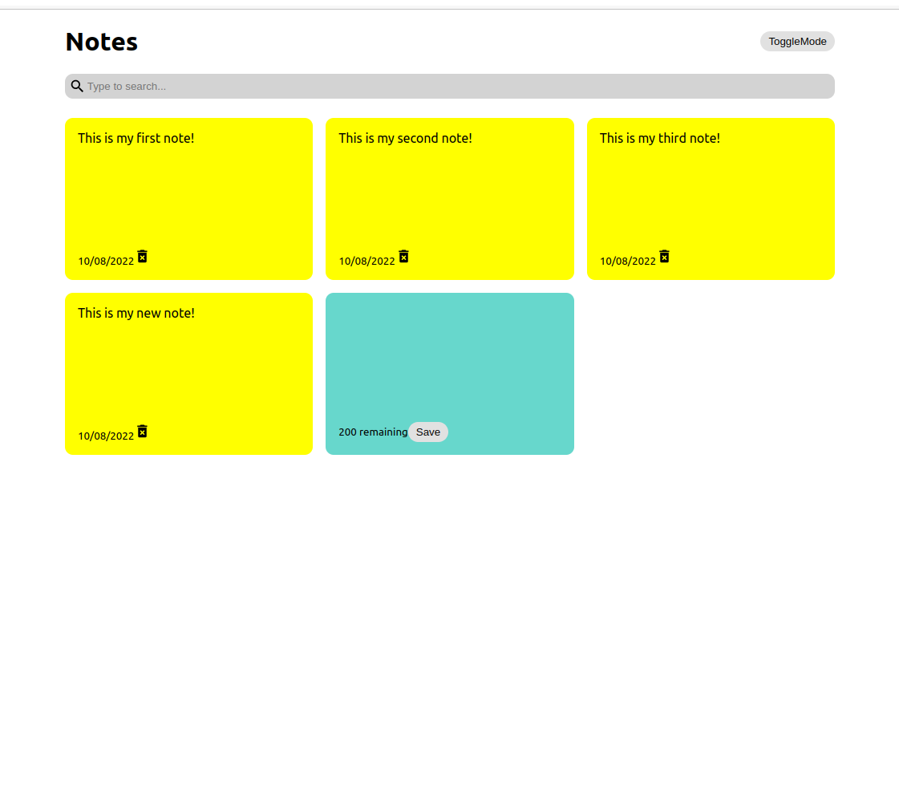
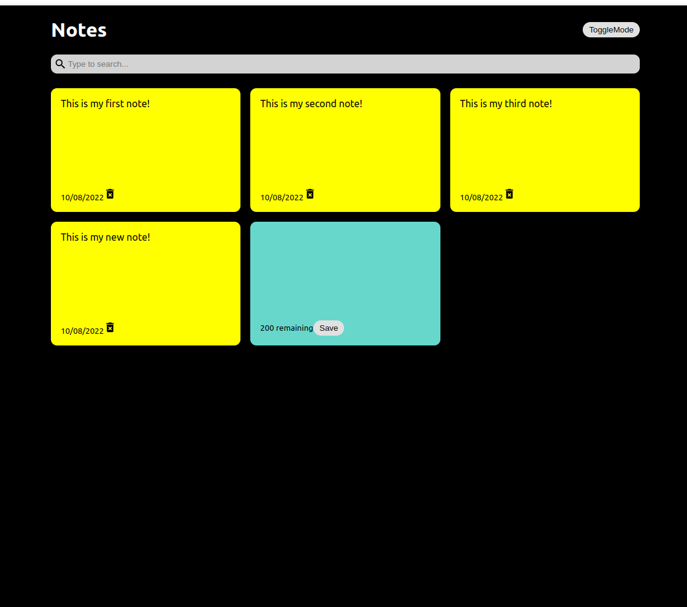

## React Notes App

## About the project:
> The purpose of this app is to create notes that have the same look of a Post-it.  The application has a search tool bar to look for an specific note. 

- **Description:**
> The project was created  using npx create-react-app, and it is also linked to a repository in GitHub.

- **- **Developed with:**
- [x] _React_
- [x] _JavaScript_
- [x] _Css_
- [x] _Git_

- **Tools:**
- [Visual Studio Code](https://code.visualstudio.com/)

- **Contact:**
GitHub: [erikayanez](https://github.com/) 
